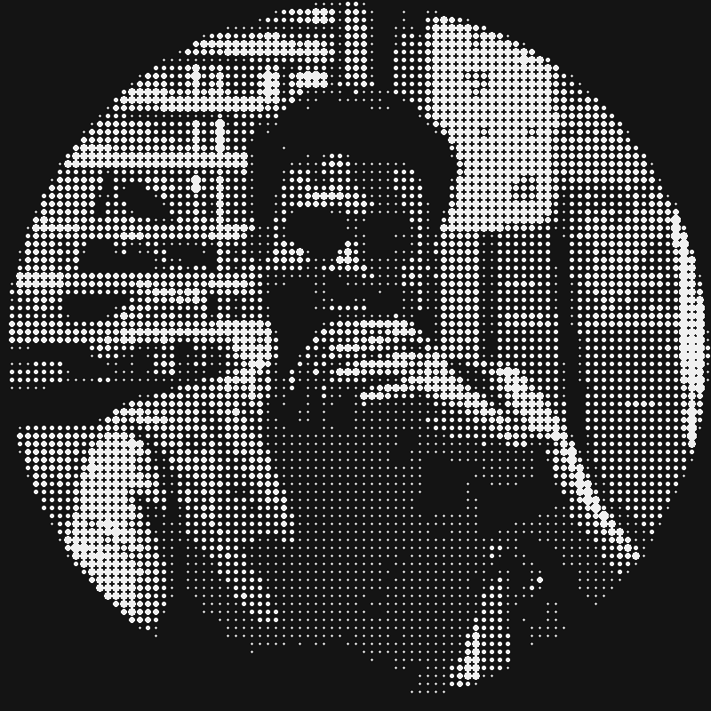

<h1>
Hello, I'm 
<b>Sidhardha</b>
</h1>

<h3>Full Stack Developer • AI Enthusiast • C++ Programmer</h3>

<h2><b>About Me</b></h2>

<ul>
<li>B.Tech CSE (3rd Year)</li>
<li>Learning Full Stack Development</li>
<li>Exploring Artificial Intelligence</li>
<li>Passionate about Data Structures & Algorithms</li>
</ul>

 

 

------------------------

# 💻 Tech Stack

<table>
<tr>

<td width="50%" valign="top">

### 💡 Programming Languages

### 🎨 Frontend

</td>

<td width="50%" valign="top">

### ⚙️ Backend

### 🗄️ Database & Tools

</td>

</tr>
</table>

------------------------

# 📊 GitHub Analytics

------------------------

