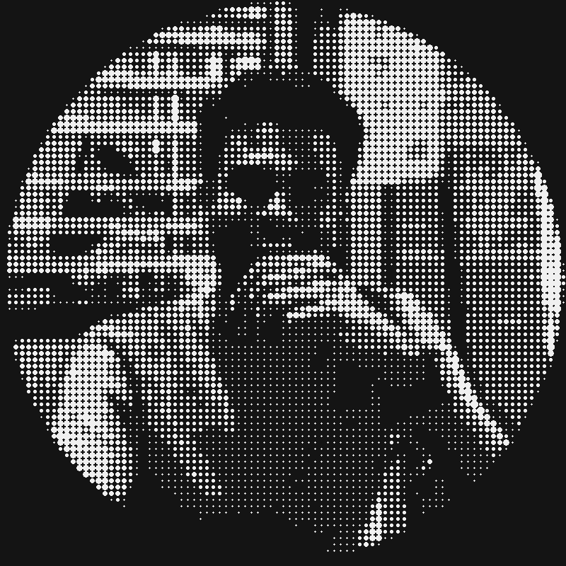

<table>
<tr>

<td width="60%" valign="middle">

## 👋 Hello, I'm

### Full Stack Developer • AI Enthusiast • C++ Programmer

Building modern web applications, exploring Artificial Intelligence, and solving problems through Data Structures & Algorithms.

### 🚀 About Me

- 🎓 B.Tech CSE (3rd Year)
- 💻 Learning Full Stack Development
- 🤖 Exploring Artificial Intelligence
- 📚 Passionate about Data Structures & Algorithms
- ⚡ Always building and learning something new

 

</td>

<td width="40%" align="center">

</td>

</tr>
</table>

---

# 💻 Tech Stack

<table>
<tr>

<td width="50%" valign="top">

### 💡 Programming Languages

  

### 🎨 Frontend

</td>

<td width="50%" valign="top">

### ⚙️ Backend

  

### 🗄️ Database & Tools

</td>

</tr>
</table>

---

# 📊 GitHub Analytics

---

